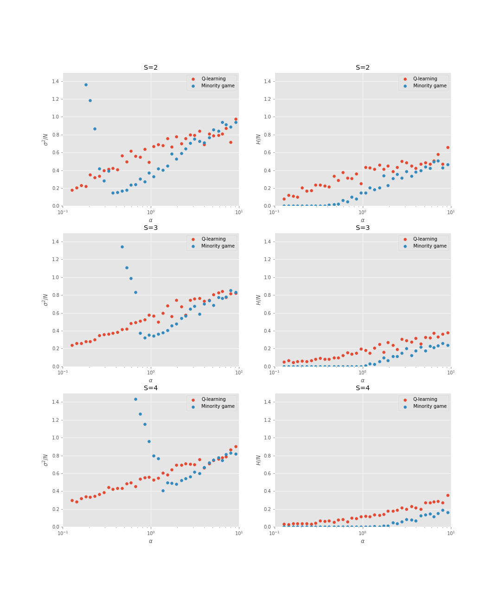

# Q learning in the minority game

C++ implementation (unofficial) of the paper "Q learning in the minority game" in Physical Review E (2001).

## Results

## References
[1] M. Andrecut and M. K. Ali. Q learning in the minority game. Physical Review E. 2001. [<a href="https://doi.org/10.1103/PhysRevE.64.067103" target="_blank">Link</a>]